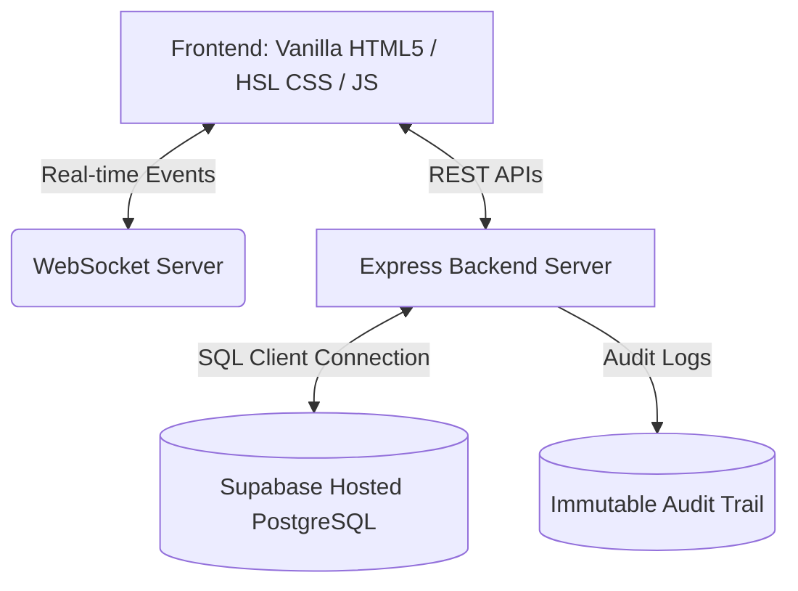

# Albelly ERP — Perishable Ice Cream Manufacturing SaaS ERP

Albelly ERP is a specialized, multi-tenant SaaS Enterprise Resource Planning (ERP) platform custom-built for small-to-medium ice cream manufacturing businesses. Managing ice cream manufacturing demands precise controls over raw dairy perishability (FEFO), strict aging/recipe procedures, cold-chain logistical compliance, and high-frequency sales desks. 

This platform connects the entire factory floor—from the arrival of raw dairy products to the dispatch of chilled containers—into a single, real-time reactive dashboard.

---

## 🌟 Specialized Core Features

### 1. Perishable Inventory & FEFO Expiry Management
* **Batch-wise Perishable Tracking:** Logs raw materials (milk, cream, stabilizers, packaging) by weight/volume associated with unique manufacturer lots.
* **First-Expired, First-Out (FEFO):** Enforces FEFO policies automatically when ingredients are allocated to production batches, ensuring the oldest perishables are consumed first.
* **Auto-Updated Stock Levels:** Instantly increments finished product catalog (bricks, cups, cones, tubs) and decrements raw materials upon production completion.

### 2. Batch Production & Recipe Management
* **Standardized Recipes:** Define bill of materials (BOM) formulas (e.g., standard vanilla mix requiring specific portions of milk fat, solid non-fat, stabilizers, and sugar).
* **Automated Ingredient Deductions:** Validates stock levels against recipe formulas and locks/deducts ingredients when a batch starts.
* **Aging & Freezing Lifecycles:** Tracks mandatory mix aging states (4–12 hours) and freezing/churning stages before packaging.

### 3. Quick POS Billing & Distributor Management
* **Interactive POS Desk:** Rapid grid-based interface with autocomplete for booking distributor orders.
* **Dynamic Pricing Engine:** Remembers and auto-completes the last purchased price for each finished good by distributor, enabling custom price negotiations.
* **Tally Ledger Balances:** Pre-calculates real-time customer balances inside PostgreSQL, eliminating client-side looping overhead.

### 4. Cold-Chain Logistics & Gate Manager
* **In-Out Gate Digital Register:** Records exact timestamps, driver names, vehicle license plates, and purposes for incoming supply trucks and outgoing shipping containers.
* **Cold-Chain Safety Thresholds:** Tracks target transit temperatures of reefers (refrigerated vehicles) during dispatch to ensure product integrity.

### 5. Traceability & Immutable Auditing
* **End-to-End Recall Traceability:** Allows operators to trace any finished ice cream batch code back to the exact supplier raw material lots used.
* **System Audit Trails:** Centralized audit logging that registers every modification (created, edited, deleted) alongside the actors and old/new JSON values.

---

## ⚙️ Technical Architecture & Stack



* **Frontend:** Built with vanilla HTML5, Custom CSS (using HSL-based color tokens, sleek dark modes, and dynamic grid layouts), and modular client-side JavaScript.
* **Backend:** Node.js + Express.js API framework. Employs a real-time HTTP server.
* **Real-time Syncing:** WebSocket server (via `ws` package) broadcasting production states, inventory adjustments, and order completions to all active client screens.
* **Database:** PostgreSQL (hosted on Supabase) utilizing indexes on key columns (`customer_name`, `SKU`, `order_date`) to ensure high-performance querying.

---

## 🗄️ Relational Database Schema

The database model is normalized to maintain relational integrity across recipes, ingredient batches, orders, and logs:

```
                  +--------------------+
                  |    distributors    |
                  +--------------------+
                            | 1
                            |
                            | 1..*
                  +--------------------+
                  |       orders       |
                  +--------------------+
                            | 1
                            |
                            | 1..*
                  +--------------------+
                  |    order_items     |
                  +--------------------+
```

### 1. `raw_materials`
Tracks generic raw material items.
```sql
CREATE TABLE raw_materials (
  id SERIAL PRIMARY KEY,
  name TEXT NOT NULL,
  SKU TEXT NOT NULL UNIQUE,
  current_stock REAL NOT NULL DEFAULT 0.0,
  unit TEXT NOT NULL,
  capacity REAL NOT NULL DEFAULT 100.0,
  safety REAL NOT NULL DEFAULT 20.0
);
```

### 2. `inventory_batches`
Tracks individual lots of raw materials with unique expiration dates.
```sql
CREATE TABLE inventory_batches (
  id SERIAL PRIMARY KEY,
  raw_material_id INTEGER REFERENCES raw_materials(id),
  batch_number TEXT NOT NULL,
  quantity_received REAL NOT NULL,
  remaining_quantity REAL NOT NULL,
  received_date TIMESTAMP DEFAULT CURRENT_TIMESTAMP,
  expiry_date TIMESTAMP NOT NULL
);
```

### 3. `recipes`
Holds finished product formula definitions.
```sql
CREATE TABLE recipes (
  id SERIAL PRIMARY KEY,
  name TEXT NOT NULL UNIQUE,
  yield REAL NOT NULL,
  unit TEXT NOT NULL
);
```

### 4. `recipe_ingredients`
Maps raw materials to standard recipes.
```sql
CREATE TABLE recipe_ingredients (
  id SERIAL PRIMARY KEY,
  recipe_id INTEGER REFERENCES recipes(id) ON DELETE CASCADE,
  raw_material_id INTEGER REFERENCES raw_materials(id),
  quantity REAL NOT NULL
);
```

### 5. `production_batches`
Handles production runs, aging processes, and output yields.
```sql
CREATE TABLE production_batches (
  id SERIAL PRIMARY KEY,
  batch_code TEXT NOT NULL UNIQUE,
  recipe_id INTEGER REFERENCES recipes(id),
  flavor_name TEXT NOT NULL,
  status TEXT NOT NULL CHECK(status IN ('AGING', 'FREEZING', 'COMPLETED')),
  quantity_produced REAL NOT NULL,
  start_time TIMESTAMP DEFAULT CURRENT_TIMESTAMP,
  expiry_date TIMESTAMP
);
```

### 6. `finished_goods`
Holds physical product inventories.
```sql
CREATE TABLE finished_goods (
  id SERIAL PRIMARY KEY,
  name TEXT NOT NULL UNIQUE,
  SKU TEXT NOT NULL UNIQUE,
  price REAL NOT NULL,
  stock_qty INTEGER NOT NULL DEFAULT 0,
  unit TEXT NOT NULL
);
```

### 7. `orders` & `order_items`
Manages wholesale customer orders.
```sql
CREATE TABLE orders (
  id SERIAL PRIMARY KEY,
  order_code TEXT NOT NULL UNIQUE,
  customer_name TEXT NOT NULL,
  order_date TIMESTAMP DEFAULT CURRENT_TIMESTAMP,
  total_amount REAL NOT NULL,
  tax_amount REAL NOT NULL,
  status TEXT NOT NULL CHECK(status IN ('PENDING', 'DISPATCHED', 'COMPLETED')),
  gst_rate REAL NOT NULL DEFAULT 0.18,
  customer_location TEXT,
  customer_gstin TEXT,
  payment_status TEXT
);

CREATE TABLE order_items (
  id SERIAL PRIMARY KEY,
  order_id INTEGER REFERENCES orders(id) ON DELETE CASCADE,
  product_name TEXT NOT NULL,
  quantity INTEGER NOT NULL,
  price REAL NOT NULL
);
```

---

## 🚀 Performance Optimizations & Query Tuning

The Albelly ERP has been tuned to handle heavy historical data loads (1000+ orders, multi-year timelines) with minimal overhead:

1. **Server-Side Pagination & Limits:**
   - Endpoint: `GET /api/v1/sales/orders`
   - Shunted from fetching 1100+ full orders to paginating with `limit` and `offset` (default: `100`).
2. **PostgreSQL Pre-aggregated Ledger Balances:**
   - Endpoint: `GET /api/v1/distributors`
   - Shifts the computation of active ledger balances from client-side JavaScript to an optimized PostgreSQL subquery:
     ```sql
     SELECT d.*, COALESCE((SELECT SUM(o.total_amount) FROM orders o WHERE o.customer_name = d.name), 0) AS balance FROM distributors d ORDER BY d.name ASC;
     ```
3. **O(1) Customer Item Pricing Map:**
   - Endpoint: `GET /api/v1/sales/last-prices?customer_name=<name>`
   - Caches the last purchased price for every item by a distributor in a key-value format `{ [product]: price }` on customer selection.
4. **Pre-Calculated Financial Dashboard summaries:**
   - Endpoint: `GET /api/v1/dashboard/financials/full-year`
   - Shunts raw multi-year order history scans into pre-aggregated subqueries grouped directly by year and distributor, reducing rendering payload by 95%.

---

## 🛣️ API Endpoints

### 🔐 Authentication & Roles
* `GET /api/v1/auth/me` — Gets the logged-in user profile.
* `POST /api/v1/auth/register-role` — Registers a newly signed-up user ID to a role.

### 📦 Inventory Management
* `GET /api/v1/inventory/raw-materials` — Lists raw materials.
* `POST /api/v1/inventory/raw-materials` — Registers a raw material lot (enforcing SKU check).
* `POST /api/v1/inventory/raw-materials/restock` — Adds a restocked batch of raw materials.

### 🍦 Production & Batches
* `GET /api/v1/production/batches` — Lists current aging/churning batches.
* `POST /api/v1/production/start` — Launches a batch based on a recipe, deducting ingredients via FEFO.
* `PUT /api/v1/production/batches/:id/status` — Moves production batches along `AGING -> FREEZING -> COMPLETED`.

### 💰 Sales & Billing
* `GET /api/v1/sales/orders` — Paginated list of sales orders.
* `POST /api/v1/sales/orders` — POS creation of a new order with stock deductions.
* `PUT /api/v1/sales/orders/:id/cancel` — Cancels an order and restores stock back to catalog.
* `GET /api/v1/sales/orders/:id/invoice` — Renders either a GST `TAX INVOICE` or a non-GST `RETAIL BILL / RECEIPT` as clean, printable HTML.

---

## 🛠️ Installation & Setup

### Prerequisites
* **Node.js** (v18 or higher)
* **PostgreSQL** database (Local or Supabase)

### Setup Instructions
1. Clone the repository:
   ```bash
   git clone https://github.com/hardik140/albelly_SAAS.git
   cd albelly_SAAS
   ```
2. Configure environmental variables in `/backend/.env`:
   ```ini
   DATABASE_URL=your_postgresql_connection_string
   PORT=3000
   ```
3. Install dependencies in the backend folder:
   ```bash
   cd backend
   npm install
   ```
4. Seed historical data & start the server:
   ```bash
   node server.js
   ```
   The backend server will verify the table schemas, run database migrations, seed initial values, and listen on `http://localhost:3000`.

5. Run integration tests:
   ```bash
   node comprehensive_test.js
   ```
